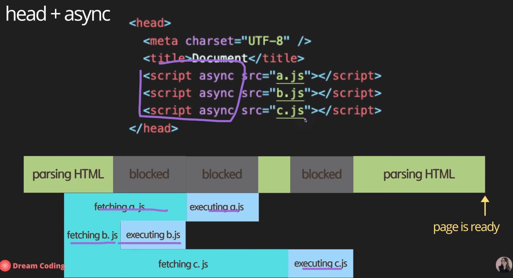

## 2. Script async and defer

[All screenshots are from here](https://www.youtube.com/watch?v=tJieVCgGzhs&list=PLv2d7VI9OotTVOL4QmPfvJWPJvkmv6h-2&index=2&ab_channel=%EB%93%9C%EB%A6%BC%EC%BD%94%EB%94%A9by%EC%97%98%EB%A6%AC)

1. Head
    

2. End of body + script JS
    - HTML 을 먼저 parsing하고 JS file을 fetching한다
    - 만약 website가 JS에 많이 의존적이면,
        - 사용자가 의미 있는 콘탠츠를 보기 위해서는 JS을 사용해 server에서 data를 받아온다든지, DOM 요소를 더 예쁘게 꾸며준다든지 그런 website는 users가 정상적인 page를 보기 전까지는 fetching JS(server에서 JS를 받아오는 시간) and executing JS (실행 시간)도 기다려야한다.
    
    

3. Head + async
    - async boolean data type (default true)
    - Fetching & Executing JS 를 parallel로 실행함
        - Fetching이 끝나는 순간 parsing HTML을 멈추고 executing JS를 한다.
    
    - 만약 JS에서 query selector를 사용해서 DOM 요소를 modify를 한다 하면 조작하는 시점에 HTML에 우리가 원하는 요소가 아직 정의 되지 않아 있을수도 있다.
    - Parsing HTML를 잠시 멈추기 때문에 사용자가 페이지 보기까지 시간이 걸린다.

    
    

4. Head + defer
    - 제일 안전하다.

    
    
